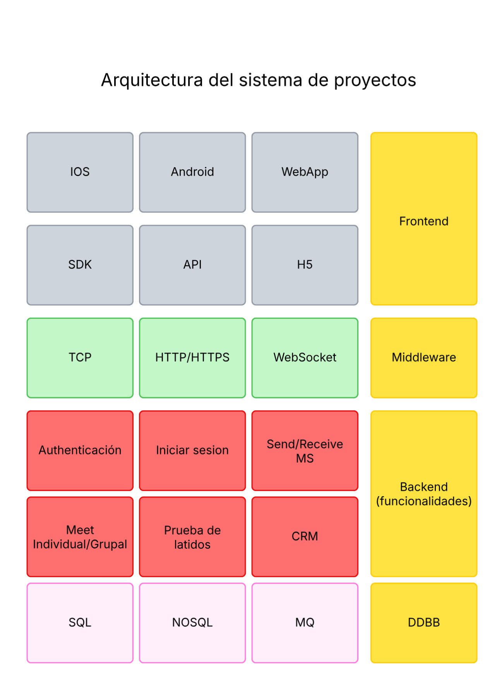
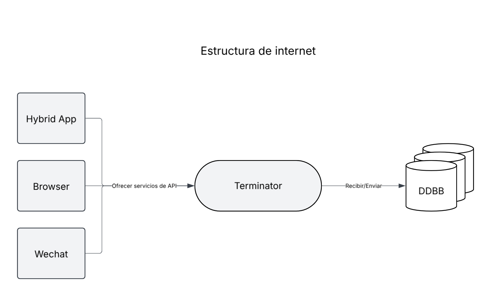
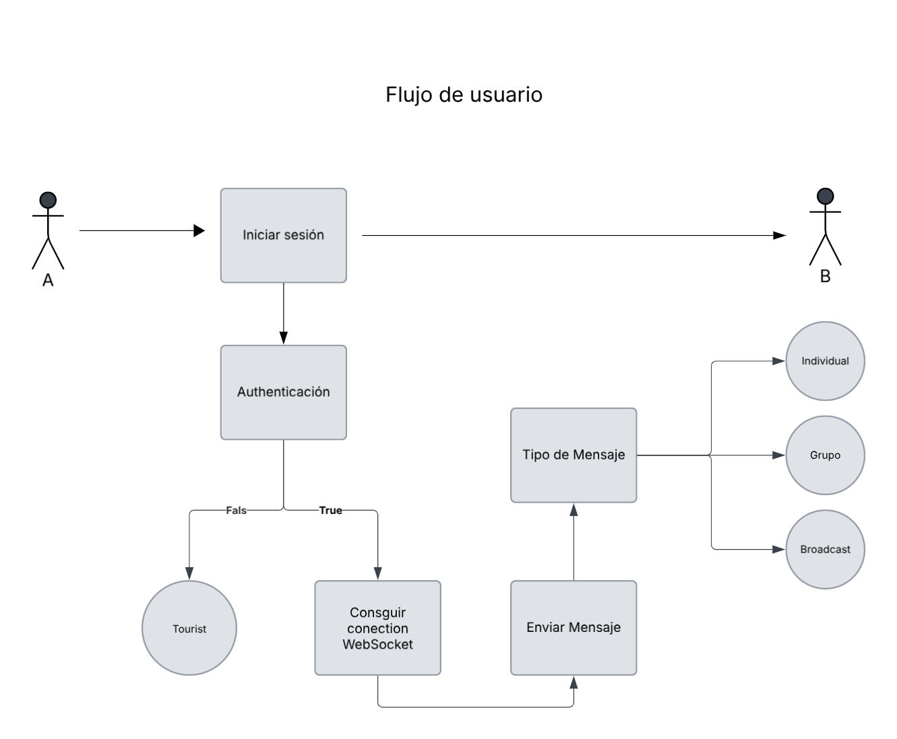

# go-im

## Introducción:

* Gin: framework para aplicaciones web;​
* API: https://gin-gonic.com/docs/

## Analisis de las demandas

### Objetivo del proyecto 

**Contexto del proyecto**: IM es un proyecto con alta concurrencia, sensible al rendimiento y a la experiencia del usuario.​

**Objetivos**: 

1) Conocer el flujo de desarrollo, 

2) Familiarizarse con los stacks Gin, GORM, Swagger, Logrus, Auth, etc.; 

3) Lograr alto rendimiento.

### Funciones principales

* **Envío y recepción de mensajes**: texto, emojis, imágenes, audio, video​
* **Modos de chat**: visitante, uno a uno, chat grupal, difusión, respuesta rápida, retractación, detección de latidos​
* **CRM**

### Stack tecnológico

### Arquitectura del sistema

### Flujo de envío de mensajes

### Construción de entorno

